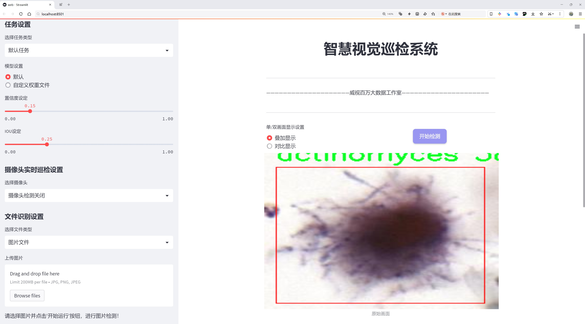
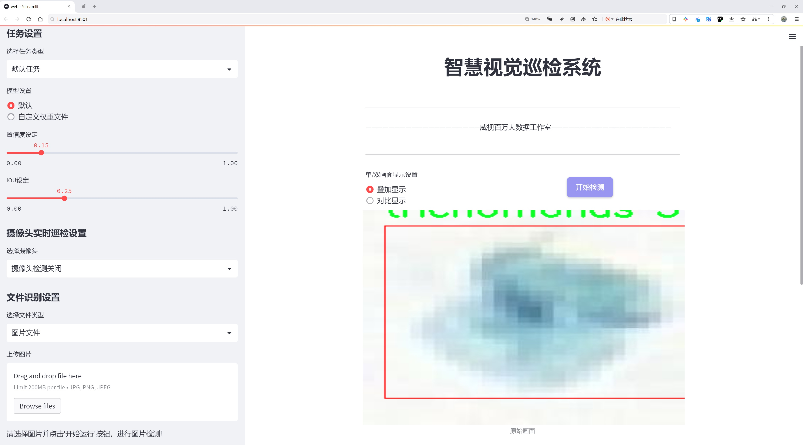
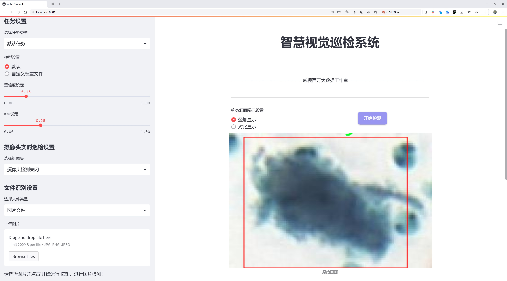
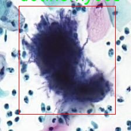
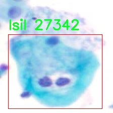
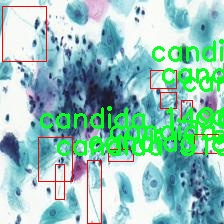
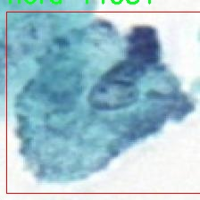
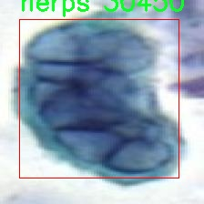

# 微生物分类检测检测系统源码分享
 # [一条龙教学YOLOV8标注好的数据集一键训练_70+全套改进创新点发刊_Web前端展示]

### 1.研究背景与意义

项目参考[AAAI Association for the Advancement of Artificial Intelligence](https://gitee.com/qunshansj/projects)

项目来源[AACV Association for the Advancement of Computer Vision](https://gitee.com/qunmasj/projects)

研究背景与意义

随着微生物学的迅速发展，微生物的分类与检测在医学、环境科学及食品安全等领域中扮演着越来越重要的角色。微生物的种类繁多，形态各异，传统的分类方法往往依赖于显微镜观察和生化实验，这不仅耗时耗力，而且对操作者的专业技能要求较高。近年来，计算机视觉和深度学习技术的迅猛发展为微生物分类检测提供了新的解决方案。尤其是YOLO（You Only Look Once）系列模型，因其在实时目标检测中的优越性能，逐渐成为微生物分类检测研究的热点。

本研究基于改进的YOLOv8模型，构建了一种高效的微生物分类检测系统。该系统利用1600幅图像的数据集，涵盖了11个微生物类别，包括放线菌、念珠菌、滴虫等，旨在提高微生物分类的准确性和效率。通过对YOLOv8模型的改进，我们希望能够在保持高检测速度的同时，提升模型对不同微生物的识别能力。这种改进不仅能够提高微生物分类的准确性，还能为临床诊断、环境监测和食品安全检测提供有力支持。

微生物的快速检测与分类对于疾病的早期诊断和治疗至关重要。例如，念珠菌感染在免疫系统受损的患者中常见，及时的检测与分类能够帮助医生制定更为有效的治疗方案。此外，环境中的微生物种类和数量直接影响生态系统的健康，利用本研究开发的检测系统，可以快速评估水体、土壤等环境样本中的微生物状况，为环境保护和生态恢复提供科学依据。在食品安全领域，微生物污染是导致食品安全事件的重要因素，快速准确的微生物检测系统能够帮助企业和监管机构及时发现潜在风险，保障公众健康。

本研究的意义不仅在于推动微生物分类检测技术的发展，更在于为相关领域提供一种新的研究工具和方法。通过改进YOLOv8模型，我们期望能够实现更高效的微生物分类，进而推动微生物学、医学、环境科学等多学科的交叉融合。未来，随着数据集的不断扩展和模型的进一步优化，该系统有望应用于更广泛的场景，助力科学研究和实际应用的进步。

综上所述，基于改进YOLOv8的微生物分类检测系统的研究，不仅具有重要的理论价值，还有着广泛的应用前景。通过提升微生物分类的自动化和智能化水平，我们将为微生物学的研究和实践提供新的动力，推动相关领域的持续发展与创新。

### 2.图片演示







##### 注意：由于此博客编辑较早，上面“2.图片演示”和“3.视频演示”展示的系统图片或者视频可能为老版本，新版本在老版本的基础上升级如下：（实际效果以升级的新版本为准）

  （1）适配了YOLOV8的“目标检测”模型和“实例分割”模型，通过加载相应的权重（.pt）文件即可自适应加载模型。

  （2）支持“图片识别”、“视频识别”、“摄像头实时识别”三种识别模式。

  （3）支持“图片识别”、“视频识别”、“摄像头实时识别”三种识别结果保存导出，解决手动导出（容易卡顿出现爆内存）存在的问题，识别完自动保存结果并导出到tempDir中。

  （4）支持Web前端系统中的标题、背景图等自定义修改，后面提供修改教程。

  另外本项目提供训练的数据集和训练教程,暂不提供权重文件（best.pt）,需要您按照教程进行训练后实现图片演示和Web前端界面演示的效果。

### 3.视频演示

[3.1 视频演示](https://www.bilibili.com/video/BV1yA4bemEdS/)

### 4.数据集信息展示

##### 4.1 本项目数据集详细数据（类别数＆类别名）

nc: 11
names: ['actinomyces', 'agc', 'asch', 'ascus', 'candida', 'flora', 'herps', 'hsil', 'lsil', 'scc', 'trichomonas']


##### 4.2 本项目数据集信息介绍

数据集信息展示

在微生物分类检测领域，数据集的构建与选择对于模型的训练和性能提升至关重要。本研究所采用的数据集名为“ComparisonDetector”，该数据集专门设计用于改进YOLOv8的微生物分类检测系统。通过精心挑选和标注的样本，ComparisonDetector为微生物的自动识别和分类提供了坚实的基础。

ComparisonDetector数据集包含11个不同的微生物类别，涵盖了多种重要的微生物种类。这些类别包括：actinomyces、agc、asch、ascus、candida、flora、herps、hsil、lsil、scc和trichomonas。每个类别都代表了一种特定的微生物，具有独特的形态特征和生物学意义。例如，actinomyces是一种常见的细菌，通常与口腔和牙齿感染相关；而candida则是一种真菌，常常与酵母感染有关。通过对这些微生物的分类，研究人员能够更好地理解其在不同环境中的作用及其对人类健康的影响。

数据集中的样本数量丰富，涵盖了不同的生长环境和培养条件，确保了模型训练的多样性和全面性。每个类别的样本均经过严格的筛选和标注，确保其准确性和可靠性。这种高质量的数据集不仅能够提高YOLOv8模型的检测精度，还能增强其在实际应用中的适应性和鲁棒性。

在数据集的构建过程中，研究团队还特别关注了样本的代表性。通过从不同的实验室和临床环境中收集样本，ComparisonDetector能够反映出微生物在实际应用中的多样性。这种多样性不仅体现在微生物的种类上，还包括了样本的形态、大小、颜色等特征，为模型的训练提供了丰富的特征信息。

此外，ComparisonDetector数据集还考虑到了微生物的图像质量和拍摄条件。所有样本均在标准化的实验室环境下拍摄，确保了图像的一致性和可比性。这种高质量的图像数据为YOLOv8模型的训练提供了良好的基础，使其能够更有效地学习到微生物的特征，从而提高分类的准确性。

在微生物分类检测的实际应用中，ComparisonDetector数据集的价值不仅体现在其丰富的类别和样本数量上，更在于其为研究人员提供了一个可靠的工具，以推动微生物学研究的进展。通过改进YOLOv8模型，研究人员能够实现更快速、更准确的微生物检测，为临床诊断和公共卫生监测提供有力支持。

综上所述，ComparisonDetector数据集在微生物分类检测系统的训练中发挥了重要作用。其丰富的类别、多样的样本和高质量的图像数据，为YOLOv8模型的改进提供了坚实的基础。随着研究的深入，期待该数据集能够在微生物检测领域带来更多的创新和突破，为人类健康的保障贡献力量。











### 5.全套项目环境部署视频教程（零基础手把手教学）

[5.1 环境部署教程链接（零基础手把手教学）](https://www.ixigua.com/7404473917358506534?logTag=c807d0cbc21c0ef59de5)


[5.2 安装Python虚拟环境创建和依赖库安装视频教程链接（零基础手把手教学）](https://www.ixigua.com/7404474678003106304?logTag=1f1041108cd1f708b01a)

### 6.手把手YOLOV8训练视频教程（零基础小白有手就能学会）

[6.1 手把手YOLOV8训练视频教程（零基础小白有手就能学会）](https://www.ixigua.com/7404477157818401292?logTag=d31a2dfd1983c9668658)

### 7.70+种全套YOLOV8创新点代码加载调参视频教程（一键加载写好的改进模型的配置文件）

[7.1 70+种全套YOLOV8创新点代码加载调参视频教程（一键加载写好的改进模型的配置文件）](https://www.ixigua.com/7404478314661806627?logTag=29066f8288e3f4eea3a4)

### 8.70+种全套YOLOV8创新点原理讲解（非科班也可以轻松写刊发刊，V10版本正在科研待更新）

由于篇幅限制，每个创新点的具体原理讲解就不一一展开，具体见下列网址中的创新点对应子项目的技术原理博客网址【Blog】：


[8.1 70+种全套YOLOV8创新点原理讲解链接](https://gitee.com/qunmasj/good)

### 9.系统功能展示（检测对象为举例，实际内容以本项目数据集为准）

图9.1.系统支持检测结果表格显示

  图9.2.系统支持置信度和IOU阈值手动调节

  图9.3.系统支持自定义加载权重文件best.pt(需要你通过步骤5中训练获得)

  图9.4.系统支持摄像头实时识别

  图9.5.系统支持图片识别

  图9.6.系统支持视频识别

  图9.7.系统支持识别结果文件自动保存

  图9.8.系统支持Excel导出检测结果数据


### 10.原始YOLOV8算法原理

原始YOLOv8算法原理

YOLOv8s作为YOLO系列的最新成员，代表了目标检测领域的一次重要进步。它不仅在性能上超越了前代模型，还在灵活性和适应性方面做出了显著改进。YOLOv8s的设计理念是通过高效的特征提取和精确的目标检测，来实现更快的推理速度和更高的检测准确率。这一切的实现依赖于其独特的网络结构，主要由Backbone、Neck和Head三部分组成。

在Backbone部分，YOLOv8s采用了CSPDarknet结构，这是一个经过精心设计的深度学习网络，旨在提取输入图像中的丰富特征。CSPDarknet的核心在于其跨阶段部分（Cross Stage Partial）设计，这种设计将网络分为两个主要部分，每个部分都包含多个残差块，从而有效地减少了梯度消失的问题并增强了特征学习能力。与前代模型YOLOv5相比，YOLOv8s引入了C2f模块，替代了传统的C3模块。C2f模块通过将输入特征图分成两个分支，并分别进行降维处理，显著提高了特征图的维度和表达能力。每个分支经过v8_C2fBottleneck层的处理后，输出结果再通过卷积层进行融合，形成更高维度的特征图。这种设计不仅提升了特征提取的效率，还为后续的目标检测提供了更为丰富的特征信息。

YOLOv8s在特征提取的过程中还采用了快速空间金字塔池化（SPPF）结构，这一结构的引入使得模型能够有效提取不同尺度的特征，适应各种目标的检测需求。SPPF通过对特征图进行多尺度处理，减少了模型的参数量和计算量，同时提高了特征提取的效率。这种高效的特征提取机制，使得YOLOv8s在面对复杂场景时，依然能够保持较高的检测性能。

在Neck部分，YOLOv8s采用了特征金字塔网络（FPN）与路径聚合网络（PAN）的结合，进一步增强了多尺度特征的融合能力。通过多层卷积和池化操作，Neck部分能够有效整合来自Backbone不同阶段的特征图，从而捕捉到不同尺度目标的信息。这种特征融合技术使得YOLOv8s在处理大小不一的目标时，表现得更加鲁棒，能够在各种复杂场景中保持高效的检测性能。

Head部分则是YOLOv8s的核心，负责最终的目标检测和分类任务。该部分设有三个检测头，分别用于处理不同尺寸的信息。每个检测头包含一系列卷积层和反卷积层，能够将经过Neck处理后的特征图转换为最终的检测结果。YOLOv8s采用了一种基于无锚框（Anchor-Free）的检测方式，这一创新的设计使得模型能够直接预测目标的中心点和宽高比例，显著减少了Anchor框的数量。这种方式不仅提高了检测速度，还在准确度上也有了显著提升，特别是在复杂背景下的目标检测中，YOLOv8s展现出了优越的性能。

YOLOv8s的训练和部署框架也进行了全新的设计，基于Pytorch的实现使得自定义模型的训练变得更加方便。这一框架的灵活性和可扩展性，使得研究人员和开发者能够根据具体应用需求，快速调整和优化模型参数，从而实现更好的检测效果。

总的来说，YOLOv8s的原始算法原理在于通过创新的网络结构和高效的特征提取方法，结合无锚框的检测策略，达到了实时检测领域的新高度。其在目标检测任务中的高精度和快速响应能力，使得YOLOv8s不仅适用于传统的图像识别任务，还能够广泛应用于自动驾驶、智能监控、机器人视觉等多个领域。随着YOLOv8s的推广和应用，目标检测技术的未来将更加光明，为各行各业带来更多的便利和创新可能。


### 11.项目核心源码讲解（再也不用担心看不懂代码逻辑）

#### 11.1 70+种YOLOv8算法改进源码大全和调试加载训练教程（非必要）\ultralytics\nn\backbone\SwinTransformer.py

以下是经过精简和注释的代码，保留了最核心的部分，主要是 `SwinTransformer` 的实现以及相关的基本组件。

```python
import torch
import torch.nn as nn
import torch.nn.functional as F
import numpy as np
from timm.models.layers import DropPath, to_2tuple, trunc_normal_

class Mlp(nn.Module):
    """ 多层感知机 (MLP) 模块 """
    def __init__(self, in_features, hidden_features=None, out_features=None, act_layer=nn.GELU, drop=0.):
        super().__init__()
        out_features = out_features or in_features  # 输出特征数
        hidden_features = hidden_features or in_features  # 隐藏层特征数
        self.fc1 = nn.Linear(in_features, hidden_features)  # 第一层线性变换
        self.act = act_layer()  # 激活函数
        self.fc2 = nn.Linear(hidden_features, out_features)  # 第二层线性变换
        self.drop = nn.Dropout(drop)  # Dropout层

    def forward(self, x):
        """ 前向传播 """
        x = self.fc1(x)
        x = self.act(x)
        x = self.drop(x)
        x = self.fc2(x)
        x = self.drop(x)
        return x

class WindowAttention(nn.Module):
    """ 窗口注意力机制 (Window-based Multi-head Self Attention) """
    def __init__(self, dim, window_size, num_heads, qkv_bias=True, attn_drop=0., proj_drop=0.):
        super().__init__()
        self.dim = dim
        self.window_size = window_size  # 窗口大小
        self.num_heads = num_heads  # 注意力头数
        head_dim = dim // num_heads  # 每个头的维度
        self.scale = head_dim ** -0.5  # 缩放因子

        # 相对位置偏置参数
        self.relative_position_bias_table = nn.Parameter(
            torch.zeros((2 * window_size[0] - 1) * (2 * window_size[1] - 1), num_heads))

        # 计算相对位置索引
        coords_h = torch.arange(self.window_size[0])
        coords_w = torch.arange(self.window_size[1])
        coords = torch.stack(torch.meshgrid([coords_h, coords_w]))  # 生成坐标网格
        coords_flatten = torch.flatten(coords, 1)  # 展平
        relative_coords = coords_flatten[:, :, None] - coords_flatten[:, None, :]  # 计算相对坐标
        relative_coords = relative_coords.permute(1, 2, 0).contiguous()  # 调整维度
        relative_coords[:, :, 0] += self.window_size[0] - 1  # 归一化
        relative_coords[:, :, 1] += self.window_size[1] - 1
        relative_coords[:, :, 0] *= 2 * self.window_size[1] - 1
        self.relative_position_index = relative_coords.sum(-1)  # 相对位置索引

        self.qkv = nn.Linear(dim, dim * 3, bias=qkv_bias)  # 线性变换生成Q, K, V
        self.attn_drop = nn.Dropout(attn_drop)  # 注意力权重的Dropout
        self.proj = nn.Linear(dim, dim)  # 输出线性变换
        self.proj_drop = nn.Dropout(proj_drop)  # 输出的Dropout

    def forward(self, x, mask=None):
        """ 前向传播 """
        B_, N, C = x.shape  # B: batch size, N: number of tokens, C: channel
        qkv = self.qkv(x).reshape(B_, N, 3, self.num_heads, C // self.num_heads).permute(2, 0, 3, 1, 4)
        q, k, v = qkv[0], qkv[1], qkv[2]  # 分离Q, K, V

        q = q * self.scale  # 缩放Q
        attn = (q @ k.transpose(-2, -1))  # 计算注意力分数

        # 添加相对位置偏置
        relative_position_bias = self.relative_position_bias_table[self.relative_position_index.view(-1)].view(
            self.window_size[0] * self.window_size[1], self.window_size[0] * self.window_size[1], -1)
        attn = attn + relative_position_bias.unsqueeze(0)

        attn = F.softmax(attn, dim=-1)  # 归一化
        attn = self.attn_drop(attn)  # Dropout

        x = (attn @ v).transpose(1, 2).reshape(B_, N, C)  # 应用注意力
        x = self.proj(x)  # 输出线性变换
        x = self.proj_drop(x)  # Dropout
        return x

class SwinTransformerBlock(nn.Module):
    """ Swin Transformer的基本块 """
    def __init__(self, dim, num_heads, window_size=7, shift_size=0, mlp_ratio=4., drop=0., attn_drop=0.):
        super().__init__()
        self.norm1 = nn.LayerNorm(dim)  # 归一化层
        self.attn = WindowAttention(dim, window_size=to_2tuple(window_size), num_heads=num_heads, attn_drop=attn_drop)  # 窗口注意力
        self.norm2 = nn.LayerNorm(dim)  # 归一化层
        mlp_hidden_dim = int(dim * mlp_ratio)  # MLP隐藏层维度
        self.mlp = Mlp(in_features=dim, hidden_features=mlp_hidden_dim, drop=drop)  # MLP模块

    def forward(self, x):
        """ 前向传播 """
        shortcut = x  # 残差连接
        x = self.norm1(x)  # 归一化
        x = self.attn(x)  # 窗口注意力
        x = shortcut + x  # 残差连接
        x = x + self.mlp(self.norm2(x))  # MLP
        return x

class SwinTransformer(nn.Module):
    """ Swin Transformer主模型 """
    def __init__(self, embed_dim=96, depths=[2, 2, 6, 2], num_heads=[3, 6, 12, 24], window_size=7):
        super().__init__()
        self.layers = nn.ModuleList()  # 存储各层
        for i_layer in range(len(depths)):
            layer = SwinTransformerBlock(
                dim=int(embed_dim * 2 ** i_layer),
                num_heads=num_heads[i_layer],
                window_size=window_size)
            self.layers.append(layer)  # 添加层

    def forward(self, x):
        """ 前向传播 """
        for layer in self.layers:
            x = layer(x)  # 逐层传递
        return x

def SwinTransformer_Tiny(weights=''):
    """ 创建一个小型的Swin Transformer模型 """
    model = SwinTransformer(depths=[2, 2, 6, 2], num_heads=[3, 6, 12, 24])
    if weights:
        model.load_state_dict(torch.load(weights)['model'])  # 加载权重
    return model
```

### 代码说明
1. **Mlp**: 实现了一个简单的多层感知机，包括两个线性层和一个激活函数。
2. **WindowAttention**: 实现了窗口注意力机制，支持相对位置偏置。
3. **SwinTransformerBlock**: 组合了归一化、窗口注意力和MLP，形成Swin Transformer的基本构建块。
4. **SwinTransformer**: 主要模型，包含多个Swin Transformer块。
5. **SwinTransformer_Tiny**: 用于创建一个小型的Swin Transformer模型，并可选择加载预训练权重。

通过这些核心组件，可以构建一个功能完整的Swin Transformer模型。

这个文件实现了Swin Transformer模型的核心组件，主要用于计算机视觉任务。Swin Transformer是一种基于Transformer的架构，采用了分层的方式和移动窗口的自注意力机制，以提高计算效率和性能。

首先，文件中定义了一个多层感知机（Mlp）类，它包含两个全连接层和一个激活函数（默认为GELU），用于对输入特征进行非线性变换。Mlp类的构造函数允许用户指定输入特征的维度、隐藏层的维度、输出特征的维度以及dropout率。

接下来，定义了窗口划分（window_partition）和窗口逆变换（window_reverse）函数，用于将输入特征划分为多个窗口，以便在窗口内进行自注意力计算。这种划分方式可以减少计算复杂度，并使得模型能够处理更大的输入图像。

然后，文件中实现了窗口注意力（WindowAttention）类，它是Swin Transformer的核心组件之一。该类实现了基于窗口的多头自注意力机制，并支持相对位置偏置。它通过计算查询、键、值的线性变换来生成注意力权重，并结合相对位置偏置来增强模型的表达能力。

Swin Transformer块（SwinTransformerBlock）类实现了一个完整的Swin Transformer块，包括归一化、窗口注意力、前馈网络（FFN）等组件。该块支持循环位移，以便在不同的窗口之间共享信息。前馈网络由一个Mlp实例构成，经过两次归一化和残差连接。

接下来，PatchMerging类用于将输入特征图的不同区域合并为更大的特征图，以实现下采样。它通过对输入特征进行线性变换来减少通道数。

BasicLayer类则定义了一个基本的Swin Transformer层，包含多个Swin Transformer块，并支持下采样。它还计算了用于循环位移的注意力掩码。

PatchEmbed类负责将输入图像划分为多个补丁，并将这些补丁嵌入到高维空间中。它使用卷积层进行补丁的线性投影，并可以选择性地应用归一化。

最后，SwinTransformer类整合了上述所有组件，构建了完整的Swin Transformer模型。它支持不同的层数、头数、窗口大小等超参数配置，并在前向传播中依次通过各个层进行特征提取。该类还提供了加载预训练权重的功能，以便在特定任务上进行微调。

整体而言，这个文件实现了Swin Transformer的基础结构，适用于各种计算机视觉任务，如图像分类、目标检测等。通过采用分层和窗口机制，Swin Transformer在保持性能的同时，显著降低了计算复杂度。

#### 11.2 ui.py

以下是经过简化和注释的核心代码部分：

```python
import sys
import subprocess

def run_script(script_path):
    """
    使用当前 Python 环境运行指定的脚本。

    Args:
        script_path (str): 要运行的脚本路径

    Returns:
        None
    """
    # 获取当前 Python 解释器的路径
    python_path = sys.executable

    # 构建运行命令，使用 streamlit 运行指定的脚本
    command = f'"{python_path}" -m streamlit run "{script_path}"'

    # 执行命令并等待其完成
    result = subprocess.run(command, shell=True)
    
    # 检查命令执行的返回码，如果不为0则表示出错
    if result.returncode != 0:
        print("脚本运行出错。")

# 主程序入口
if __name__ == "__main__":
    # 指定要运行的脚本路径
    script_path = "web.py"  # 这里可以替换为实际的脚本路径

    # 调用函数运行脚本
    run_script(script_path)
```

### 代码注释说明：
1. **导入模块**：
   - `sys`：用于获取当前 Python 解释器的路径。
   - `subprocess`：用于执行外部命令。

2. **`run_script` 函数**：
   - 功能：接受一个脚本路径，使用当前 Python 环境运行该脚本。
   - 参数：`script_path`，要运行的脚本的路径。
   - 获取当前 Python 解释器的路径，并构建运行命令。
   - 使用 `subprocess.run` 执行命令，并检查返回码以判断脚本是否成功运行。

3. **主程序入口**：
   - 检查是否是主程序运行，指定要运行的脚本路径。
   - 调用 `run_script` 函数执行指定的脚本。

这个程序文件名为 `ui.py`，其主要功能是通过当前的 Python 环境运行一个指定的脚本。代码的结构比较简单，主要包含了几个重要的部分。

首先，程序导入了必要的模块，包括 `sys`、`os` 和 `subprocess`。其中，`sys` 模块用于访问与 Python 解释器相关的变量和函数，`os` 模块提供了与操作系统交互的功能，而 `subprocess` 模块则用于创建新进程、连接到它们的输入/输出/错误管道，并获取它们的返回码。

接下来，程序定义了一个名为 `run_script` 的函数，该函数接受一个参数 `script_path`，表示要运行的脚本的路径。在函数内部，首先获取当前 Python 解释器的路径，并将其存储在 `python_path` 变量中。然后，构建一个命令字符串，该命令用于运行指定的脚本，使用了 `streamlit` 这个库来启动一个 Web 应用。

随后，使用 `subprocess.run` 方法执行构建好的命令。该方法会在一个新的 shell 中运行命令，并等待其完成。如果脚本运行的返回码不为零，说明在执行过程中出现了错误，程序会打印出“脚本运行出错”的提示信息。

最后，在程序的主入口部分，首先调用 `abs_path` 函数来获取 `web.py` 脚本的绝对路径，并将其赋值给 `script_path` 变量。然后，调用 `run_script` 函数来运行这个脚本。

总体来说，这个程序的目的是为了方便地通过当前的 Python 环境运行一个名为 `web.py` 的脚本，并在运行过程中处理可能出现的错误。

#### 11.3 70+种YOLOv8算法改进源码大全和调试加载训练教程（非必要）\ultralytics\data\loaders.py

以下是经过简化和注释的核心代码部分，主要集中在 `LoadStreams` 类的实现上。该类负责加载和处理视频流。

```python
import cv2
import numpy as np
from threading import Thread
from pathlib import Path
from urllib.parse import urlparse
import time
import math

class LoadStreams:
    """
    用于加载各种类型的视频流。

    支持 RTSP、RTMP、HTTP 和 TCP 流。

    属性:
        sources (str): 视频流的输入路径或 URL。
        imgsz (int): 处理图像的大小，默认为 640。
        vid_stride (int): 视频帧率步幅，默认为 1。
        buffer (bool): 是否缓冲输入流，默认为 False。
        running (bool): 标志，指示流线程是否正在运行。
        imgs (list): 每个流的图像帧列表。
        fps (list): 每个流的帧率列表。
        frames (list): 每个流的总帧数列表。
        threads (list): 每个流的线程列表。
        shape (list): 每个流的形状列表。
        caps (list): 每个流的 cv2.VideoCapture 对象列表。
        bs (int): 处理的批量大小。

    方法:
        __init__: 初始化流加载器。
        update: 在守护线程中读取流帧。
        close: 关闭流加载器并释放资源。
        __iter__: 返回类的迭代器对象。
        __next__: 返回源路径、转换后的图像和原始图像以供处理。
        __len__: 返回源对象的长度。
    """

    def __init__(self, sources='file.streams', imgsz=640, vid_stride=1, buffer=False):
        """初始化实例变量并检查输入流形状的一致性。"""
        self.buffer = buffer  # 缓冲输入流
        self.running = True  # 线程运行标志
        self.imgsz = imgsz
        self.vid_stride = vid_stride  # 视频帧率步幅
        sources = Path(sources).read_text().rsplit() if Path(sources).is_file() else [sources]
        n = len(sources)
        self.sources = [x.strip() for x in sources]  # 清理源名称
        self.imgs, self.fps, self.frames, self.threads, self.shape = [[]] * n, [0] * n, [0] * n, [None] * n, [[]] * n
        self.caps = [None] * n  # 视频捕获对象列表

        for i, s in enumerate(sources):  # 遍历每个源
            # 启动线程以从视频流读取帧
            self.caps[i] = cv2.VideoCapture(s)  # 存储视频捕获对象
            if not self.caps[i].isOpened():
                raise ConnectionError(f'无法打开 {s}')
            w = int(self.caps[i].get(cv2.CAP_PROP_FRAME_WIDTH))  # 获取视频宽度
            h = int(self.caps[i].get(cv2.CAP_PROP_FRAME_HEIGHT))  # 获取视频高度
            fps = self.caps[i].get(cv2.CAP_PROP_FPS)  # 获取视频帧率
            self.frames[i] = max(int(self.caps[i].get(cv2.CAP_PROP_FRAME_COUNT)), 0) or float('inf')  # 获取总帧数
            self.fps[i] = max((fps if math.isfinite(fps) else 0) % 100, 0) or 30  # 帧率后备

            success, im = self.caps[i].read()  # 确保读取第一帧
            if not success or im is None:
                raise ConnectionError(f'无法从 {s} 读取图像')
            self.imgs[i].append(im)  # 将第一帧添加到图像列表
            self.shape[i] = im.shape  # 存储图像形状
            self.threads[i] = Thread(target=self.update, args=([i, self.caps[i], s]), daemon=True)  # 启动更新线程
            self.threads[i].start()  # 启动线程

    def update(self, i, cap, stream):
        """在守护线程中读取流 `i` 的帧。"""
        n = 0  # 帧计数器
        while self.running and cap.isOpened():
            if len(self.imgs[i]) < 30:  # 保持 <=30 图像缓冲
                n += 1
                cap.grab()  # 抓取下一帧
                if n % self.vid_stride == 0:  # 根据步幅读取帧
                    success, im = cap.retrieve()  # 获取帧
                    if not success:
                        im = np.zeros(self.shape[i], dtype=np.uint8)  # 如果失败，创建空图像
                    if self.buffer:
                        self.imgs[i].append(im)  # 如果缓冲，添加图像
                    else:
                        self.imgs[i] = [im]  # 否则只保留最新图像
            else:
                time.sleep(0.01)  # 等待缓冲区清空

    def close(self):
        """关闭流加载器并释放资源。"""
        self.running = False  # 停止线程
        for thread in self.threads:
            if thread.is_alive():
                thread.join(timeout=5)  # 等待线程结束
        for cap in self.caps:  # 释放视频捕获对象
            cap.release()  # 释放视频捕获

    def __iter__(self):
        """返回 YOLO 图像源的迭代器。"""
        self.count = -1
        return self

    def __next__(self):
        """返回源路径、转换后的图像和原始图像以供处理。"""
        self.count += 1
        images = []
        for i, x in enumerate(self.imgs):
            while not x:  # 等待帧可用
                time.sleep(1 / min(self.fps))  # 等待
                x = self.imgs[i]
            images.append(x.pop(0))  # 获取并移除第一帧
        return self.sources, images, None, ''  # 返回源、图像、视频捕获和字符串

    def __len__(self):
        """返回源对象的长度。"""
        return len(self.sources)  # 返回源数量
```

### 代码说明：
1. **LoadStreams 类**：负责加载视频流，支持多种流类型（如 RTSP、RTMP、HTTP 等）。
2. **初始化方法 (`__init__`)**：读取源路径，初始化视频捕获对象，并启动线程以异步读取视频帧。
3. **更新方法 (`update`)**：在后台线程中不断读取视频帧，并根据需要缓冲帧。
4. **关闭方法 (`close`)**：停止所有线程并释放资源。
5. **迭代器方法 (`__iter__` 和 `__next__`)**：支持迭代，返回当前帧和源信息。

通过这些核心部分，代码能够有效地处理视频流并为后续的图像处理提供支持。

这个程序文件是一个用于YOLOv8算法的加载器，主要负责处理不同类型的数据源，包括视频流、截图、图像和张量等。文件中定义了多个类，每个类负责不同的数据加载任务，具体功能如下：

首先，文件引入了一些必要的库，包括用于图像处理的OpenCV、NumPy、PIL，以及用于网络请求的requests库等。接着，定义了一个数据类`SourceTypes`，用于表示输入源的不同类型，如网络摄像头、截图、图像文件和张量。

`LoadStreams`类用于加载视频流，支持RTSP、RTMP、HTTP和TCP等多种流媒体格式。该类的构造函数初始化了一些属性，包括输入源、图像大小、视频帧率等，并启动线程以读取视频流中的帧。类中有多个方法，如`update`用于在后台线程中读取帧，`close`用于关闭流并释放资源，`__iter__`和`__next__`方法用于迭代读取图像帧。

`LoadScreenshots`类则专门用于加载屏幕截图，支持实时捕获屏幕内容。构造函数中使用了`mss`库来实现屏幕捕获，并根据输入参数设置捕获区域的大小和位置。

`LoadImages`类用于加载图像和视频文件，支持从单个文件、视频文件或文件路径列表中读取数据。该类的构造函数会检查文件的存在性，并根据文件类型分类为图像或视频。类中同样实现了迭代器方法，以便逐个读取图像或视频帧。

`LoadPilAndNumpy`类用于从PIL和NumPy数组中加载图像，确保图像格式正确，并进行必要的转换，以便后续处理。

`LoadTensor`类则专注于从PyTorch张量中加载图像，验证输入张量的形状和数值范围，确保其符合YOLOv8的要求。

此外，文件中还定义了一个`autocast_list`函数，用于将不同类型的输入源合并为NumPy数组或PIL图像的列表。最后，`get_best_youtube_url`函数用于从YouTube视频中提取最佳质量的MP4视频流URL，支持使用`pafy`或`yt_dlp`库。

整体来看，这个文件为YOLOv8模型提供了灵活的数据加载功能，能够处理多种输入源，便于后续的图像处理和模型推理。

#### 11.4 70+种YOLOv8算法改进源码大全和调试加载训练教程（非必要）\ultralytics\models\yolo\segment\predict.py

以下是代码中最核心的部分，并附上详细的中文注释：

```python
from ultralytics.engine.results import Results  # 导入结果处理类
from ultralytics.models.yolo.detect.predict import DetectionPredictor  # 导入检测预测器基类
from ultralytics.utils import DEFAULT_CFG, ops  # 导入默认配置和操作工具

class SegmentationPredictor(DetectionPredictor):
    """
    继承自 DetectionPredictor 类的分割预测器类，用于基于分割模型的预测。
    """

    def __init__(self, cfg=DEFAULT_CFG, overrides=None, _callbacks=None):
        """初始化 SegmentationPredictor，使用提供的配置、覆盖参数和回调函数。"""
        super().__init__(cfg, overrides, _callbacks)  # 调用父类构造函数
        self.args.task = 'segment'  # 设置任务类型为分割

    def postprocess(self, preds, img, orig_imgs):
        """对每个输入图像的预测结果进行后处理，包括非极大值抑制和检测结果处理。"""
        # 应用非极大值抑制，过滤掉低置信度的检测框
        p = ops.non_max_suppression(preds[0],
                                    self.args.conf,  # 置信度阈值
                                    self.args.iou,  # IOU 阈值
                                    agnostic=self.args.agnostic_nms,  # 是否进行类别无关的 NMS
                                    max_det=self.args.max_det,  # 最大检测框数量
                                    nc=len(self.model.names),  # 类别数量
                                    classes=self.args.classes)  # 选择的类别

        # 如果输入图像不是列表，转换为 numpy 数组
        if not isinstance(orig_imgs, list):
            orig_imgs = ops.convert_torch2numpy_batch(orig_imgs)

        results = []  # 存储结果的列表
        proto = preds[1][-1] if len(preds[1]) == 3 else preds[1]  # 获取掩膜原型

        # 遍历每个预测结果
        for i, pred in enumerate(p):
            orig_img = orig_imgs[i]  # 获取原始图像
            img_path = self.batch[0][i]  # 获取图像路径
            
            if not len(pred):  # 如果没有检测到目标
                masks = None  # 不生成掩膜
            elif self.args.retina_masks:  # 如果需要使用 Retina 掩膜
                # 调整检测框的大小
                pred[:, :4] = ops.scale_boxes(img.shape[2:], pred[:, :4], orig_img.shape)
                # 处理掩膜
                masks = ops.process_mask_native(proto[i], pred[:, 6:], pred[:, :4], orig_img.shape[:2])  # HWC
            else:  # 否则使用常规掩膜处理
                masks = ops.process_mask(proto[i], pred[:, 6:], pred[:, :4], img.shape[2:], upsample=True)  # HWC
                # 调整检测框的大小
                pred[:, :4] = ops.scale_boxes(img.shape[2:], pred[:, :4], orig_img.shape)

            # 将结果添加到结果列表中
            results.append(Results(orig_img, path=img_path, names=self.model.names, boxes=pred[:, :6], masks=masks))
        
        return results  # 返回处理后的结果
```

### 代码核心部分说明：
1. **类 SegmentationPredictor**：该类用于进行图像分割的预测，继承自检测预测器。
2. **初始化方法**：设置任务类型为分割，并调用父类的初始化方法。
3. **后处理方法 postprocess**：对模型的预测结果进行后处理，包括：
   - 应用非极大值抑制（NMS）来过滤低置信度的检测框。
   - 处理原始图像和掩膜的大小调整。
   - 将处理后的结果存储在 `results` 列表中并返回。

这个程序文件是一个用于YOLOv8算法的分割预测类，名为`SegmentationPredictor`，它继承自`DetectionPredictor`类。该类的主要功能是对输入的图像进行分割预测，适用于图像分割任务。

在文件的开头，导入了一些必要的模块和类，包括`Results`、`DetectionPredictor`和一些工具函数。接着，定义了`SegmentationPredictor`类，并在类文档字符串中提供了一个使用示例，说明如何创建该类的实例并调用预测功能。

构造函数`__init__`接受三个参数：`cfg`（配置），`overrides`（覆盖参数），和`_callbacks`（回调函数）。在构造函数中，调用了父类的构造函数，并将任务类型设置为“segment”，表示该类专注于分割任务。

`postprocess`方法是该类的核心功能之一，负责对模型的预测结果进行后处理。它首先调用非极大值抑制（NMS）来过滤掉重叠的检测框，保留置信度高的框。接着，检查输入的原始图像是否为列表，如果不是，则将其转换为NumPy数组格式。

在处理每个预测结果时，`postprocess`方法会根据预测的形状和内容来处理掩膜（masks）。如果没有检测到目标，则掩膜设置为`None`。如果启用了`retina_masks`选项，则使用原生处理方法生成掩膜；否则，使用常规的掩膜处理方法。最后，将处理后的结果封装成`Results`对象，包含原始图像、路径、类别名称、检测框和掩膜，并将这些结果存储在一个列表中返回。

总的来说，这个文件提供了一个功能强大的分割预测工具，能够对输入图像进行高效的分割处理，并返回结构化的结果，方便后续的分析和应用。

#### 11.5 code\ultralytics\solutions\heatmap.py

以下是代码中最核心的部分，并附上详细的中文注释：

```python
import cv2
import numpy as np
from collections import defaultdict
from shapely.geometry import LineString, Point, Polygon

class Heatmap:
    """用于实时视频流中绘制热图的类，基于对象的轨迹进行绘制。"""

    def __init__(self):
        """初始化热图类，设置默认的可视化、图像和热图参数。"""
        # 可视化信息
        self.annotator = None  # 注释器，用于在图像上绘制
        self.view_img = False  # 是否显示图像
        self.shape = "circle"  # 热图形状，默认为圆形

        # 图像信息
        self.imw = None  # 图像宽度
        self.imh = None  # 图像高度
        self.im0 = None  # 原始图像
        self.view_in_counts = True  # 是否显示进入计数
        self.view_out_counts = True  # 是否显示离开计数

        # 热图的颜色映射和热图数组
        self.colormap = None  # 热图颜色映射
        self.heatmap = None  # 热图数据
        self.heatmap_alpha = 0.5  # 热图透明度

        # 预测/跟踪信息
        self.boxes = None  # 目标框
        self.track_ids = None  # 跟踪ID
        self.clss = None  # 类别
        self.track_history = defaultdict(list)  # 跟踪历史记录

        # 区域和线的信息
        self.count_reg_pts = None  # 计数区域的点
        self.counting_region = None  # 计数区域
        self.line_dist_thresh = 15  # 线计数的距离阈值
        self.region_thickness = 5  # 区域厚度
        self.region_color = (255, 0, 255)  # 区域颜色

        # 对象计数信息
        self.in_counts = 0  # 进入计数
        self.out_counts = 0  # 离开计数
        self.counting_list = []  # 计数列表
        self.count_txt_thickness = 0  # 计数文本厚度
        self.count_txt_color = (0, 0, 0)  # 计数文本颜色
        self.count_color = (255, 255, 255)  # 计数背景颜色

        # 衰减因子
        self.decay_factor = 0.99  # 热图衰减因子

    def set_args(self, imw, imh, colormap=cv2.COLORMAP_JET, heatmap_alpha=0.5, view_img=False,
                 view_in_counts=True, view_out_counts=True, count_reg_pts=None,
                 count_txt_thickness=2, count_txt_color=(0, 0, 0), count_color=(255, 255, 255),
                 count_reg_color=(255, 0, 255), region_thickness=5, line_dist_thresh=15,
                 decay_factor=0.99, shape="circle"):
        """
        配置热图的颜色映射、宽度、高度和显示参数。

        参数:
            imw (int): 帧的宽度。
            imh (int): 帧的高度。
            colormap (cv2.COLORMAP): 要设置的颜色映射。
            heatmap_alpha (float): 热图显示的透明度。
            view_img (bool): 是否显示帧。
            view_in_counts (bool): 是否在视频流中显示进入计数。
            view_out_counts (bool): 是否在视频流中显示离开计数。
            count_reg_pts (list): 对象计数区域的点。
            count_txt_thickness (int): 对象计数显示的文本厚度。
            count_txt_color (RGB color): 计数文本颜色值。
            count_color (RGB color): 计数文本背景颜色值。
            count_reg_color (RGB color): 对象计数区域的颜色。
            region_thickness (int): 对象计数区域的厚度。
            line_dist_thresh (int): 线计数的欧几里得距离阈值。
            decay_factor (float): 对象经过后移除热图区域的值。
            shape (str): 热图形状，支持矩形或圆形。
        """
        self.imw = imw
        self.imh = imh
        self.heatmap_alpha = heatmap_alpha
        self.view_img = view_img
        self.view_in_counts = view_in_counts
        self.view_out_counts = view_out_counts
        self.colormap = colormap

        # 选择区域和线
        if count_reg_pts is not None:
            if len(count_reg_pts) == 2:  # 线计数
                self.count_reg_pts = count_reg_pts
                self.counting_region = LineString(count_reg_pts)
            elif len(count_reg_pts) == 4:  # 区域计数
                self.count_reg_pts = count_reg_pts
                self.counting_region = Polygon(self.count_reg_pts)
            else:
                print("区域或线点无效，仅支持2或4个点")
                self.counting_region = Polygon([(20, 400), (1260, 400)])  # 默认点

        # 初始化热图
        self.heatmap = np.zeros((int(self.imh), int(self.imw)), dtype=np.float32)

        self.count_txt_thickness = count_txt_thickness
        self.count_txt_color = count_txt_color
        self.count_color = count_color
        self.region_color = count_reg_color
        self.region_thickness = region_thickness
        self.decay_factor = decay_factor
        self.line_dist_thresh = line_dist_thresh
        self.shape = shape

    def extract_results(self, tracks):
        """
        从提供的数据中提取结果。

        参数:
            tracks (list): 从对象跟踪过程中获得的轨迹列表。
        """
        self.boxes = tracks[0].boxes.xyxy.cpu()  # 获取目标框
        self.clss = tracks[0].boxes.cls.cpu().tolist()  # 获取类别
        self.track_ids = tracks[0].boxes.id.int().cpu().tolist()  # 获取跟踪ID

    def generate_heatmap(self, im0, tracks):
        """
        根据跟踪数据生成热图。

        参数:
            im0 (nd array): 图像。
            tracks (list): 从对象跟踪过程中获得的轨迹列表。
        """
        self.im0 = im0  # 保存原始图像
        if tracks[0].boxes.id is None:  # 如果没有跟踪ID
            if self.view_img:
                self.display_frames()  # 显示帧
            return
        self.heatmap *= self.decay_factor  # 应用衰减因子
        self.extract_results(tracks)  # 提取跟踪结果

        # 绘制计数区域
        if self.count_reg_pts is not None:
            for box, cls, track_id in zip(self.boxes, self.clss, self.track_ids):
                # 根据形状绘制热图
                if self.shape == "circle":
                    center = (int((box[0] + box[2]) // 2), int((box[1] + box[3]) // 2))
                    radius = min(int(box[2]) - int(box[0]), int(box[3]) - int(box[1])) // 2
                    y, x = np.ogrid[0 : self.heatmap.shape[0], 0 : self.heatmap.shape[1]]
                    mask = (x - center[0]) ** 2 + (y - center[1]) ** 2 <= radius**2
                    self.heatmap[int(box[1]) : int(box[3]), int(box[0]) : int(box[2])] += (
                        2 * mask[int(box[1]) : int(box[3]), int(box[0]) : int(box[2])]
                    )
                else:
                    self.heatmap[int(box[1]) : int(box[3]), int(box[0]) : int(box[2])] += 2

                # 记录跟踪历史
                track_line = self.track_history[track_id]
                track_line.append((float((box[0] + box[2]) / 2), float((box[1] + box[3]) / 2)))
                if len(track_line) > 30:
                    track_line.pop(0)  # 保持历史记录长度

                # 计数对象
                if len(self.count_reg_pts) == 4:  # 区域计数
                    if self.counting_region.contains(Point(track_line[-1])) and track_id not in self.counting_list:
                        self.counting_list.append(track_id)
                        if box[0] < self.counting_region.centroid.x:
                            self.out_counts += 1  # 离开计数
                        else:
                            self.in_counts += 1  # 进入计数
                elif len(self.count_reg_pts) == 2:  # 线计数
                    distance = Point(track_line[-1]).distance(self.counting_region)
                    if distance < self.line_dist_thresh and track_id not in self.counting_list:
                        self.counting_list.append(track_id)
                        if box[0] < self.counting_region.centroid.x:
                            self.out_counts += 1
                        else:
                            self.in_counts += 1

        # 归一化热图并与原始图像结合
        heatmap_normalized = cv2.normalize(self.heatmap, None, 0, 255, cv2.NORM_MINMAX)
        heatmap_colored = cv2.applyColorMap(heatmap_normalized.astype(np.uint8), self.colormap)

        # 显示计数
        counts_label = f"In Count : {self.in_counts} OutCount : {self.out_counts}"
        self.im0 = cv2.addWeighted(self.im0, 1 - self.heatmap_alpha, heatmap_colored, self.heatmap_alpha, 0)

        if self.view_img:
            self.display_frames()  # 显示帧

        return self.im0  # 返回处理后的图像

    def display_frames(self):
        """显示帧。"""
        cv2.imshow("Ultralytics Heatmap", self.im0)  # 显示热图

        if cv2.waitKey(1) & 0xFF == ord("q"):  # 按'q'键退出
            return

if __name__ == "__main__":
    Heatmap()  # 创建Heatmap类的实例
```

### 代码说明：
1. **Heatmap类**：该类用于实时生成热图，基于目标的轨迹进行绘制和计数。
2. **初始化方法**：设置类的初始参数，包括可视化、图像、热图、计数信息等。
3. **set_args方法**：配置热图的各种参数，如图像大小、颜色映射、计数区域等。
4. **extract_results方法**：从跟踪数据中提取目标框、类别和跟踪ID。
5. **generate_heatmap方法**：根据跟踪数据生成热图，绘制计数区域，更新计数，并将热图与原始图像结合。
6. **display_frames方法**：用于显示处理后的图像。

通过这些核心部分，Heatmap类能够在视频流中实时绘制热图并进行对象计数。

这个程序文件定义了一个名为 `Heatmap` 的类，用于在实时视频流中基于目标的轨迹绘制热图。程序首先导入了一些必要的库，包括 `cv2` 和 `numpy`，以及一些来自 `ultralytics` 的工具函数和 `shapely` 库中的几何形状类。

在 `Heatmap` 类的构造函数中，初始化了一些默认值，包括视觉信息、图像信息、热图参数、预测和跟踪信息、区域和线的信息、物体计数信息等。具体来说，类中定义了用于存储热图、图像宽高、计数区域、跟踪历史等的属性，并设置了一些用于显示的参数，如热图的透明度、形状等。

`set_args` 方法用于配置热图的各种参数，包括图像的宽度和高度、热图的颜色映射、显示选项、计数区域的点、文本的颜色和厚度等。该方法根据传入的计数区域点的数量（2个或4个）来确定是使用线计数器还是区域计数器，并初始化热图数组。

`extract_results` 方法从跟踪数据中提取目标的边界框、类别和跟踪ID等信息。

`generate_heatmap` 方法是生成热图的核心，接收当前帧图像和跟踪数据。首先，它会检查跟踪数据是否有效，然后应用衰减因子更新热图。接着，调用 `extract_results` 方法提取跟踪结果，并使用 `Annotator` 类来处理图像注释。根据设定的计数区域，程序会绘制计数区域，并根据目标的边界框更新热图。

在更新热图时，程序会根据设定的形状（圆形或矩形）计算热图的贡献区域，并将其添加到热图中。同时，程序还会根据目标的轨迹判断目标是进入还是离开计数区域，并更新相应的计数。

最后，程序会对热图进行归一化处理，并将其与原始图像结合显示。根据用户的设置，程序会在图像上显示进入和离开的计数信息。

`display_frames` 方法用于显示当前帧图像，并在按下 "q" 键时退出显示。

在文件的最后，`if __name__ == "__main__":` 语句用于实例化 `Heatmap` 类，但没有执行其他操作。这个类可以在实际应用中被调用，以便在视频流中实时生成和显示热图。

#### 11.6 train.py

以下是代码中最核心的部分，并附上详细的中文注释：

```python
class DetectionTrainer(BaseTrainer):
    """
    DetectionTrainer类用于基于检测模型进行训练，继承自BaseTrainer类。
    """

    def build_dataset(self, img_path, mode="train", batch=None):
        """
        构建YOLO数据集。

        参数:
            img_path (str): 包含图像的文件夹路径。
            mode (str): 模式，`train`表示训练模式，`val`表示验证模式，用户可以为每种模式自定义不同的数据增强。
            batch (int, optional): 批次大小，仅用于`rect`模式。默认为None。
        """
        gs = max(int(de_parallel(self.model).stride.max() if self.model else 0), 32)  # 获取模型的最大步幅
        return build_yolo_dataset(self.args, img_path, batch, self.data, mode=mode, rect=mode == "val", stride=gs)

    def get_dataloader(self, dataset_path, batch_size=16, rank=0, mode="train"):
        """构造并返回数据加载器。"""
        assert mode in ["train", "val"]  # 确保模式为训练或验证
        with torch_distributed_zero_first(rank):  # 如果使用分布式数据并行，确保只初始化一次数据集
            dataset = self.build_dataset(dataset_path, mode, batch_size)  # 构建数据集
        shuffle = mode == "train"  # 训练模式下打乱数据
        if getattr(dataset, "rect", False) and shuffle:
            LOGGER.warning("WARNING ⚠️ 'rect=True'与DataLoader的shuffle不兼容，设置shuffle=False")
            shuffle = False  # 如果是rect模式，关闭打乱
        workers = self.args.workers if mode == "train" else self.args.workers * 2  # 设置工作线程数
        return build_dataloader(dataset, batch_size, workers, shuffle, rank)  # 返回数据加载器

    def preprocess_batch(self, batch):
        """对一批图像进行预处理，包括缩放和转换为浮点数。"""
        batch["img"] = batch["img"].to(self.device, non_blocking=True).float() / 255  # 将图像转移到设备并归一化
        if self.args.multi_scale:  # 如果启用多尺度
            imgs = batch["img"]
            sz = (
                random.randrange(self.args.imgsz * 0.5, self.args.imgsz * 1.5 + self.stride)
                // self.stride
                * self.stride
            )  # 随机选择一个新的尺寸
            sf = sz / max(imgs.shape[2:])  # 计算缩放因子
            if sf != 1:
                ns = [
                    math.ceil(x * sf / self.stride) * self.stride for x in imgs.shape[2:]
                ]  # 计算新的形状
                imgs = nn.functional.interpolate(imgs, size=ns, mode="bilinear", align_corners=False)  # 进行插值缩放
            batch["img"] = imgs  # 更新批次图像
        return batch

    def get_model(self, cfg=None, weights=None, verbose=True):
        """返回YOLO检测模型。"""
        model = DetectionModel(cfg, nc=self.data["nc"], verbose=verbose and RANK == -1)  # 创建检测模型
        if weights:
            model.load(weights)  # 加载权重
        return model

    def get_validator(self):
        """返回用于YOLO模型验证的DetectionValidator。"""
        self.loss_names = "box_loss", "cls_loss", "dfl_loss"  # 定义损失名称
        return yolo.detect.DetectionValidator(
            self.test_loader, save_dir=self.save_dir, args=copy(self.args), _callbacks=self.callbacks
        )  # 返回验证器

    def plot_training_samples(self, batch, ni):
        """绘制带有注释的训练样本。"""
        plot_images(
            images=batch["img"],
            batch_idx=batch["batch_idx"],
            cls=batch["cls"].squeeze(-1),
            bboxes=batch["bboxes"],
            paths=batch["im_file"],
            fname=self.save_dir / f"train_batch{ni}.jpg",
            on_plot=self.on_plot,
        )
```

### 代码说明：
1. **DetectionTrainer类**：用于训练YOLO检测模型，继承自BaseTrainer类，包含了数据集构建、数据加载、图像预处理、模型获取、验证器获取等功能。
2. **build_dataset方法**：根据给定的图像路径和模式构建YOLO数据集，支持训练和验证模式。
3. **get_dataloader方法**：构造数据加载器，支持多线程和数据打乱，确保在分布式训练中只初始化一次数据集。
4. **preprocess_batch方法**：对输入的图像批次进行预处理，包括归一化和多尺度调整。
5. **get_model方法**：返回YOLO检测模型，并可选择性加载预训练权重。
6. **get_validator方法**：返回用于模型验证的验证器，定义了损失名称。
7. **plot_training_samples方法**：绘制训练样本及其注释，便于可视化训练过程。

这个程序文件 `train.py` 是一个用于训练 YOLO（You Only Look Once）目标检测模型的实现，继承自 `BaseTrainer` 类。它包含了一系列方法，用于构建数据集、获取数据加载器、预处理图像、设置模型属性、获取模型、进行验证、记录损失、显示训练进度、绘制训练样本和绘制训练指标等。

首先，`DetectionTrainer` 类的构造函数没有显示定义，但它会调用父类 `BaseTrainer` 的构造函数。该类的主要功能是为 YOLO 模型的训练提供必要的支持。

`build_dataset` 方法用于构建 YOLO 数据集，接受图像路径、模式（训练或验证）和批量大小作为参数。它通过调用 `build_yolo_dataset` 函数来生成数据集，确保根据模式选择适当的增强方法。

`get_dataloader` 方法则负责构建并返回数据加载器。它会根据模式（训练或验证）初始化数据集，并设置是否打乱数据。对于训练模式，数据加载器会随机打乱数据，而在验证模式下则不会。

`preprocess_batch` 方法用于对图像批次进行预处理，包括将图像缩放到合适的大小并转换为浮点数。它还支持多尺度训练，通过随机选择图像大小来增强模型的鲁棒性。

`set_model_attributes` 方法用于设置模型的属性，包括类别数量和类别名称。这些信息是从数据集中提取的，并附加到模型上，以便在训练过程中使用。

`get_model` 方法用于返回一个 YOLO 检测模型。如果提供了权重参数，它会加载相应的权重。

`get_validator` 方法返回一个用于验证 YOLO 模型的验证器，能够计算并记录训练过程中的损失。

`label_loss_items` 方法用于返回带有标签的训练损失项字典，这在目标检测和分割任务中是必要的。

`progress_string` 方法返回一个格式化的字符串，显示训练进度，包括当前的 epoch、GPU 内存使用情况、损失值、实例数量和图像大小。

`plot_training_samples` 方法用于绘制训练样本及其注释，以便于可视化训练过程中的数据。

最后，`plot_metrics` 和 `plot_training_labels` 方法用于绘制训练指标和标签，帮助用户分析模型的训练效果。

总体来说，这个文件提供了一个完整的框架，用于训练 YOLO 模型，涵盖了数据处理、模型设置、训练过程监控和结果可视化等多个方面。

### 12.系统整体结构（节选）

### 整体功能和构架概括

该项目是一个基于YOLOv8的目标检测和分割框架，提供了多种算法改进和调试加载训练的功能。整体架构包括数据加载、模型构建、训练、预测和结果可视化等模块。每个模块通过不同的文件进行组织，使得代码结构清晰且易于维护。

- **数据加载**：使用 `loaders.py` 加载和处理图像、视频流等输入数据，支持多种数据源。
- **模型构建**：使用 `SwinTransformer.py` 和其他模型文件构建YOLOv8及其变种模型。
- **训练过程**：通过 `train.py` 进行模型训练，包含数据预处理、损失计算、训练进度监控等功能。
- **预测与验证**：使用 `predict.py` 和 `val.py` 进行模型的预测和验证，输出检测结果和性能指标。
- **结果可视化**：通过 `heatmap.py` 和其他可视化工具展示模型的检测结果和热图，帮助分析模型性能。
- **用户界面**：`ui.py` 提供了一个简单的用户界面，用于运行模型和查看结果。

### 文件功能整理表

| 文件路径                                                                                         | 功能描述                                                                                       |
|--------------------------------------------------------------------------------------------------|-----------------------------------------------------------------------------------------------|
| `ultralytics/nn/backbone/SwinTransformer.py`                                                    | 实现Swin Transformer模型的核心组件，用于计算机视觉任务的特征提取。                           |
| `ui.py`                                                                                         | 提供一个简单的用户界面，用于运行指定的脚本并处理输出。                                       |
| `ultralytics/data/loaders.py`                                                                   | 定义数据加载器，支持从多种数据源（图像、视频流等）加载数据。                                 |
| `ultralytics/models/yolo/segment/predict.py`                                                   | 实现YOLOv8分割模型的预测功能，处理输入图像并返回分割结果。                                   |
| `ultralytics/solutions/heatmap.py`                                                             | 生成和显示目标检测的热图，基于目标的轨迹绘制热图以分析目标分布。                             |
| `train.py`                                                                                      | 负责YOLO模型的训练过程，包括数据集构建、模型设置、损失计算和训练监控等。                     |
| `ultralytics/utils/checks.py`                                                                   | 提供一些实用的检查函数，用于验证输入参数和模型的有效性。                                     |
| `ultralytics/models/yolo/obb/val.py`                                                           | 实现YOLO模型的验证功能，计算模型在验证集上的性能指标。                                       |
| `ultralytics/engine/trainer.py`                                                                 | 定义训练引擎，管理训练过程中的各个环节，包括模型训练、验证和结果记录。                       |
| `ultralytics/models/rtdetr/train.py`                                                            | 实现RT-DETR模型的训练过程，包含数据处理和模型训练逻辑。                                      |
| `ultralytics/models/rtdetr/val.py`                                                              | 实现RT-DETR模型的验证过程，计算模型在验证集上的性能指标。                                   |
| `code/web.py`                                                                                   | 提供Web接口，允许用户通过浏览器与模型进行交互，提交任务并查看结果。                          |
| `ultralytics/trackers/utils/__init__.py`                                                       | 初始化跟踪器相关的工具函数和类，支持目标跟踪功能。                                           |

这个表格总结了每个文件的主要功能，帮助理解整个项目的结构和功能模块。

注意：由于此博客编辑较早，上面“11.项目核心源码讲解（再也不用担心看不懂代码逻辑）”中部分代码可能会优化升级，仅供参考学习，完整“训练源码”、“Web前端界面”和“70+种创新点源码”以“13.完整训练+Web前端界面+70+种创新点源码、数据集获取”的内容为准。

### 13.完整训练+Web前端界面+70+种创新点源码、数据集获取


# [下载链接：https://mbd.pub/o/bread/ZpuUmp1w](https://mbd.pub/o/bread/ZpuUmp1w)